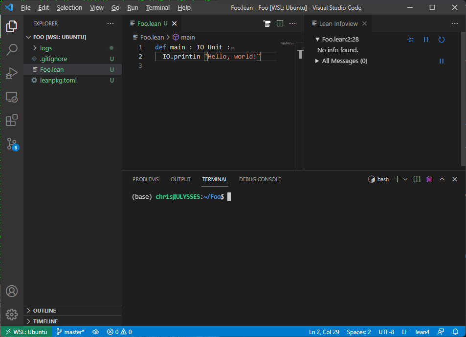

[vscode]: https://code.visualstudio.com/Download
[wsl]: https://docs.microsoft.com/en-us/windows/wsl/install-win10

# Lean in Windows WSL

As an alternative to the [MSYS2](msys2.md) setup you can also use the
[Windows Subsystem for Linux][wsl] to build Lean there, but edit and
debug using [Visual Studio Code][vscode] in Windows.

For the most part setup in WSL is the same as
[Ubuntu](Ubuntu-16.04.md). This document provides additional
information on how to setup Windows Visual Studio Code remote
debugging into your WSL environment using the lean extension running
in WSL.

It is recommended that you setup Ubuntu in [WSL
2](https://docs.microsoft.com/en-us/windows/wsl/compare-versions).
Then follow the [Dev setup using elan](../dev/index.md#dev-setup-using-elan).

## Visual Studio Code setup on Windows

Install [Visual Studio Code][vscode] on Windows.  Install the VS Code
`Remote Development` extension from Microsoft.  This extension
includes the `Remote - WSL` extension. Install the lean4 extension but
into the WSL using: `Install in WSL: Ubuntu`

Type `Ctrl+Shift+P` and select `Remote-WSL: Open Folder in WSL...` to
open a folder containing your hello world lean package.

When everything is working you should see something like this with a
functioning infoview, syntax coloring and tooltips:




## Troubleshooting

**lean4: Could not find Lean version by running 'lean --version'.**

Check that the `lean` program is available in your PATH in your WSL
environment.

**Logs are showing up with a windows file path**

Check that you have not set a windows path in your
`lean4.serverLogging.path` Visual Studio Code setting. it is best if
this setting is set as follows:

```json
  "lean4.serverLogging.path": "logs"
```

This will result in a logs folder being created inside your lean
package folder in the WSL file system.