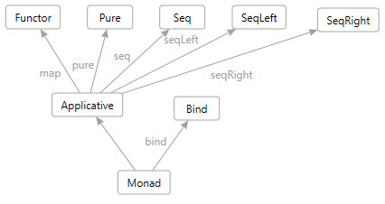

# Monads

Monads are used heavily in Lean, as they are also in Haskell. Monads come from the wonderful world
of [Category Theory](https://en.wikipedia.org/wiki/Monad_(category_theory).

Monads in Lean are so similar to Haskell that this introduction to monads is heavily based on the
similar chapter of the [Monday Morning Haskell](https://mmhaskell.com/monads/). Many thanks to
the authors of that material for allowing us to reuse it here.

Monads build on the following more fundamental type classes which you will need to understand
first before fully understanding monads:

This chapter is organized to give you a bottom up introduction to monads, starting with functors and
applicative functors to get an intuition for how these abstract structures work in Lean. Then we’ll
tackle monads and look at some of the most common ones.

## [Functor](functors.lean.md)
A functor is a type class that provides a `map` function and the map function is something many
people are already familiar with so this should be easy to follow.

## [Applicative Functors](applicatives.lean.md)
Applicatives are a little more difficult to understand than functors, but their functionality can
still be summed up in a couple simple functions.

## [Monads Tutorial](monads.lean.md)
Now that you have an intuition for how abstract structures work, we’ll examine some of the problems
that applicative functors and functors don't help you solve. Then we’ll get into the specifics of how
we actually use monads.

## [Reader Monads](readers.lean.md)
Our introduction to monads examined the built in types that have a monadic structure. It had a focus
on those things that you’ve seen in action, but maybe never thought of monadically. In this section, we
start exploring some of the common monadic idioms that you’ll need outside of the basics. We’ll
examine the Reader monad, which gives you a global read-only state.

## [State Monad](states.lean.md)
This section introduces the State monad. This monad allows you to keep a particular type that we can
both read from and write to. It opens the door to fully stateful programming, allowing you to do many
of the things a function programming language supposedly “can’t” do.

## [Except Monad](except.lean.md)

This section introduces the Except monad. Similar to the Option monad this monad allows you to change
the signature of a function so that it can return an `ok` value or and `error` when combined with
`try/catch` functions it provides a Monad based way of doing exception handling.

## [Monad Transformers](transformers.lean.md)

Now that you are familiar with all the above monads it is time to answer the question of how you can
make them work together. After all, there are definitely times when we need multiple kinds of
monadic behavior. This section introduces the concept of monad transformers, which allow you to
combine multiple monads into one.

## [Monad Laws](laws.lean.md)
In this section we’ll examine what makes a monad a monad. After all, can't you just implement these
type classes any way you want and write a “monad” instance? Starting back with functors and
applicative functors, you’ll learn that all these structures have “laws” that they are expected to
obey with respect to their behavior. We can make instances that don’t follow these laws. But we do
so at our peril, as other programmers will be very confused by the behavior.