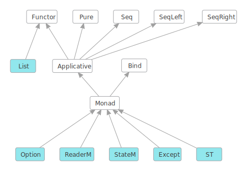

# Monads

Monads are used heavily in Lean, as they are also in Haskell. Monads come from the wonderful world
of [Category Theory](https://en.wikipedia.org/wiki/Monad_%28category_theory%29).

Monads in Lean are so similar to Haskell that this introduction to monads is heavily based on the
similar chapter of the [Monday Morning Haskell](https://mmhaskell.com/monads/). Many thanks to
the authors of that material for allowing it to reused it here.

Monads build on the following fundamental type classes which you will need to understand
first before fully understanding monads. Shown in light blue are some concrete functors
and monads that will also be covered in this chapter:

This chapter is organized to give you a bottom up introduction to monads, starting with functors and
applicative functors, you'll get an intuition for how these abstract structures work in Lean. Then
you'll dive into monads and learn how to use some of the most useful built-in ones.

## [Functor](functors.lean.md)
A functor is a type class that provides a map function and the map function is something many
people are already familiar with so this should be easy to follow.  Here you will see some
concrete examples in action with `List` and `Option`.

## [Applicative Functors](applicatives.lean.md)
Applicatives are a little more difficult to understand than functors, but their functionality can
still be summed up in a couple simple functions.  Here you will learn how to create an
`Applicative List` and a completely custom `Applicative` type.

## [Monads Tutorial](monads.lean.md)
Now that you have an intuition for how abstract structures work, you'll examine some of the problems
that functors and applicative functors don't help you solve. Then you'll learn the specifics of how
to actually use monads with some examples using the `Option` monad and the all important `IO` monad.

## [Reader Monads](readers.lean.md)
Now that you understand the details of what makes a monadic structure work, in this section, you'll
learn about one of the most useful built in monads `ReaderM`, which gives your programs a
global read-only context.

## [State Monad](states.lean.md)
This section introduces the `StateM` monad. This monad allows you to access a particular type that you can
both read from and write to. It opens the door to fully stateful programming, allowing you to do many
of the things a function programming language supposedly "can't" do.

## [Except Monad](except.lean.md)

Similar to the `Option` monad the `Except` monad allows you to change the signature of a function so
that it can return an `ok` value or an `error` and it provides the classic exception handling
operations `throw/try/catch` so that your programs can do monad-based exception handling.

## [Monad Transformers](transformers.lean.md)

Now that you are familiar with all the above monads it is time to answer the question - how you can
make them work together? After all, there are definitely times when you need multiple kinds of
monadic behavior. This section introduces the concept of monad transformers, which allow you to
combine multiple monads into one.

## [Monad Laws](laws.lean.md)
This section examines what makes a monad a legal monad. You could just implement your monadic type
classes any way you want and write "monad" instances, but starting back with functors and
applicative functors, you'll learn that all these structures have "laws" that they are expected to
obey with respect to their behavior. You can make instances that don't follow these laws. But you do
so at your peril, as other programmers will be very confused when they try to use them.