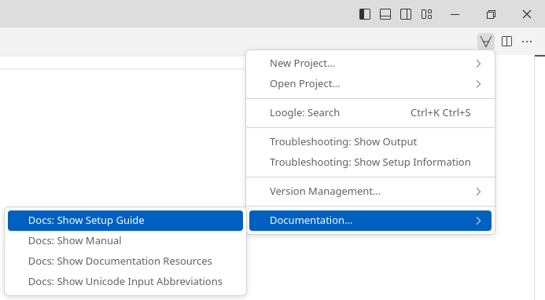
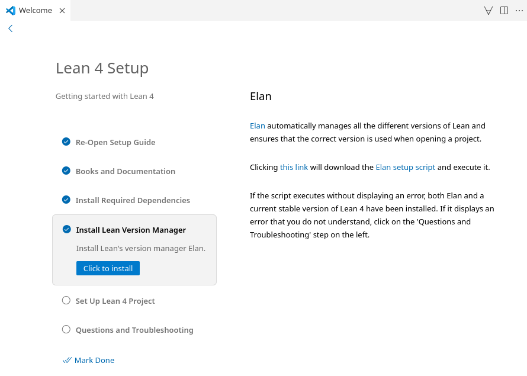

# Quickstart

These instructions will walk you through setting up Lean 4 together with VS Code as an editor for Lean 4.
See [Setup](./setup.md) for supported platforms and other ways to set up Lean 4.

1. Install [VS Code](https://code.visualstudio.com/).

1. Launch VS Code and install the `lean4` extension by clicking on the "Extensions" sidebar entry and searching for "lean4".

    

1. Open the Lean 4 setup guide by creating a new text file using "File > New Text File" (`Ctrl+N`), clicking on the ∀-symbol in the top right and selecting "Documentation… > Setup: Show Setup Guide".

    

1. Follow the Lean 4 setup guide. It will walk you through learning resources for Lean 4, teach you how to set up Lean's dependencies on your platform, install Lean 4 for you at the click of a button and help you set up your first project.

    
