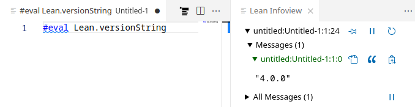

# Quickstart

These instructions will walk you through setting up Lean using the "basic" setup and VS Code as the editor.
See [Setup](./setup.md) for other ways, supported platforms, and more details on setting up Lean.

See quick [walkthrough demo video](https://www.youtube.com/watch?v=yZo6k48L0VY).

1. Install [VS Code](https://code.visualstudio.com/).

1. Launch VS Code and install the `lean4` extension.

    

1. Create a new file using "File > New Text File" (`Ctrl+N`). Click the `Select a language` prompt, type in `lean4`, and hit ENTER.  You should see the following popup:
    

    Click the "Install Lean using Elan" button. You should see some progress output like this:

    ```
    info: syncing channel updates for 'stable'
    info: latest update on stable, lean version v4.0.0
    info: downloading component 'lean'
    ```
    If there is no popup, you probably have Elan installed already.
    You may want to make sure that your default toolchain is Lean 4 in this case by running `elan default leanprover/lean4:stable` and reopen the file, as the next step will fail otherwise.

1. While it is installing, you can paste the following Lean program into the new file:

    ```lean
    #eval Lean.versionString
    ```

    When the installation has finished, the Lean Language Server should start automatically and you should get syntax-highlighting and a "Lean Infoview" popping up on the right.  You will see the output of the `#eval` statement when
    you place your cursor at the end of the statement.

    

You are set up!

## Create a Lean Project

*If your goal is to contribute to [mathlib4](https://github.com/leanprover-community/mathlib4) or use it as a dependency, please see its readme for specific instructions on how to do that.*

You can now create a Lean project in a new folder. Run `lake init foo` from "View > Terminal" to create a package, followed by `lake build` to get an executable version of your Lean program.
On Linux/macOS, you first have to follow the instructions printed by the Lean installation or log out and in again for the Lean executables to be available in you terminal.

Note: Packages **have** to be opened using "File > Open Folder..." for imports to work.
Saved changes are visible in other files after running "Lean 4: Refresh File Dependencies" (`Ctrl+Shift+X`).

## Troubleshooting

**The InfoView says "Waiting for Lean server to start..." forever.**

Check that the VS Code Terminal is not showing some installation errors from `elan`.
If that doesn't work, try also running the VS Code command `Developer: Reload Window`.
