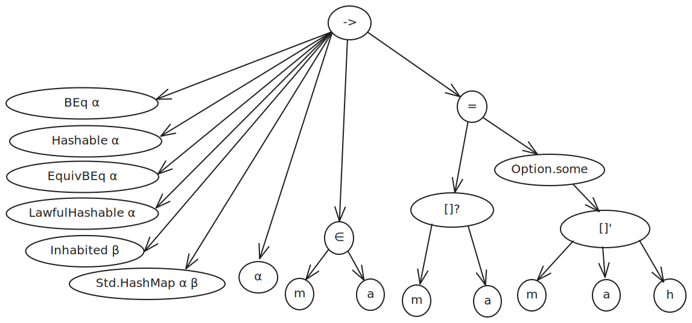

# Standard library naming conventions

The easiest way to access a result in the standard library is to correctly guess the name of the declaration (possibly with the help of identifier autocompletion). This is faster and has lower friction than more sophisticated search tools, so easily guessable names (which are still reasonably short) make Lean users more productive.

The guide that follows contains a few rules, many heuristics and a selection of examples. It cannot and does not present a deterministic algorithm for choosing good names in all situations. It is intended as a living document that gets clarified and expanded as situations arise during code reviews for the standard library.

## Naming convention for types and data

When defining a type, i.e., a (possibly 0-ary) function whose codomain is Sort u for some u, it should be named in UpperCamelCase. Examples include List, and List.IsPrefix.

When defining data, i.e., a (possibly 0-ary) function whose codomain is not Sort u, but has type Type u for some u, it should be named in lowerCamelCase. Examples include List.append and List.isPrefixOf.
If your data is morally fully specified by its type, then use the naming procedure for theorems described below and convert the result to lower camel case.

Otherwise, your function is a theorem, and you should proceed to the next section.

## Naming algorithm for theorems and some definitions

There is, in principle, a general algorithm for naming a theorem. The problem with this algorithm is that it produces very long and unwieldy names which need to be shortened. So choosing a name for a declaration can be thought of as consisting of a mechanical part and a creative part.

To start, consider the type of your declaration as a tree. Inner nodes of this tree are function types or function applications. Leaves of the tree are 0-ary functions or bound variables.

As an example, consider the following result from the standard library:

```lean
example {α : Type u} {β : Type v} [BEq α] [Hashable α] [EquivBEq α] [LawfulHashable α]
    [Inhabited β] {m : Std.HashMap α β} {a : α} {h' : a ∈ m} : m[a]? = some (m[a]'h') :=
  sorry
```

The corresponding tree looks like this:



The preferred spelling of a notation can be looked up by hovering over the notation.

Now traverse the tree and build a name according to the following rules:

* When encountering a function type, first turn the result type into a name, then all of the argument types from left to right, and join the names using `_of_`.
* When encountering a function that is neither an infix notation nor a structure projection, first put the function name and then the arguments, joined by an underscore.
* When encountering an infix notation, join the arguments using the name of the notation, separated by underscores.
* When encountering a structure projection, proceed as for normal functions, but put the name of the projection last.
* When encountering a name, put it in lower camel case.
* Skip bound variables and proofs.
* Type class arguments are also generally skipped.

When encountering namespaces names, concatenate them in lower camel case.

Applying this algorithm to our example yields the name `getElem?_eq_optionSome_getElem!_of_stdHashMap_of_mem`.

From there, the name should be shortened, using the following heuristics:

* The object a theorem is about should possibly be a namespace. See also the section on generalized projection notation below.
* The namespace of functions can be omitted if it is clear from context or if the namespace is the current one. This is almost always the case.
* For infix operators, it is possible to leave out the RHS or the name of the notation and the RHS if they are clear from context.
* Hypotheses can be left out if it is clear that they are required or if they appear in the conclusion.

Based on this, here are some possible names for our example:

1. `Std.HashMap.getElem?_eq`
2. `Std.HashMap.getElem?_eq_of_mem`
3. `Std.HashMap.getElem?_eq_some`
4. `Std.HashMap.getElem?_eq_some_of_mem`
5. `Std.HashMap.getElem?_eq_some_getElem`
6. `Std.Hashmap.getElem?_eq_some_getElem!_of_mem`

Choosing a good name among these then requires considering the context of the lemma. In this case it turns out that the first four options are underspecified as there is also a lemma relating `m[a]?` and `m[a]!` which could have the same name. This leaves the last two options, the first of which is shorter, and this is how the lemma is called in the Lean standard library.

Here are some additional examples:

```lean
example {x y : List α} (h : x <+: y) (hx : x ≠ []) :
  x.head hx = y.head (h.ne_nil hx) := sorry
```

Here the algorithm suggests `listHead_eq_listHead_of_prefix_of_ne_nil`, which is shortened to `List.IsPrefix.head`. Note here the difference between the namespace name (`IsPrefix`) and the recommended spelling of the corresponding notation (`prefix`).

```lean
example : l₁ <+: l₂ → reverse l₁ <:+ reverse l₂ := sorry
```

Taking for granted that the result should be in the `List` namespace, here the algorithm suggests `List.reverse_prefix_reverse_of_prefix`, which becomes `List.IsPrefix.reverse`.

The following examples show how the traversal order often matters.

```lean
theorem Nat.mul_zero (n : Nat) : n * 0 = 0 := sorry
theorem Nat.zero_mul (n : Nat) : 0 * n = 0 := sorry
```

Here we see that one name may be a prefix of another name:

```lean
theorem Int.mul_ne_zero {a b : Int} (a0 : a ≠ 0) (b0 : b ≠ 0) : a * b ≠ 0 := sorry
theorem Int.mul_ne_zero_iff {a b : Int} : a * b ≠ 0 ↔ a ≠ 0 ∧ b ≠ 0 := sorry
```

The more common you expect (or want) a theorem to be, the shorter you should try to make the name. For example, we have both

```lean
theorem Std.HashMap.getElem?_eq_none_of_contains_eq_false {a : α} : m.contains a = false → m[a]? = none := sorry
theorem Std.HashMap.getElem?_eq_none {a : α} : ¬a ∈ m → m[a]? = none := sorry
```

As users of the hash map are encouraged to use ∈ rather than contains, the second lemma gets the shorter name.

## Special cases

There are certain special “keywords” that may appear in identifiers.

| Keyword | Meaning | Example |
| :---- | :---- | :---- |
| `def` | Unfold a definition | `Nat.max_def` |
| `refl` | Theorems of the form `a R a`, where R is a reflexive relation | `Nat.le_refl` |
| `irrefl` | Theorems of the form `¬a R a`, where R is an irreflexive relation | `Nat.lt_irrefl` |
| `symm` | Theorems of the form `a R b→ b R a`, where R is a symmetric relation (compare `comm` below) | `Eq.symm` |
| `trans` | Theorems of the form `a R b → b R c → a R c`, where R is a transitive relation (R may carry data) | `Eq.trans` |
| `antisymmm` | Theorems of the form `a R b → b R a → a = b`, where R is an antisymmetric relation | `Nat.le_antisymm` |
| `congr` | Theorems of the form `a R b → f a S f b`, where R and S are usually equivalence relations | `Std.HashMap.mem_congr` |
| `comm` | Theorems of the form `f a b = f b a` (compare `symm` above) | `Eq.comm`, `Nat.add_comm` |
| `assoc` | Theorems of the form `g (f a b) c = f a (g b c)` (note the order! In most cases, we have f = g) | `Nat.add_sub_assoc` |
| `distrib` | Theorems of the form `f (g a b) = g (f a) (f b)` | `Nat.add_left_distrib` |
| `self` | May be used if a variable appears multiple times in the conclusion | `List.mem_cons_self` |
| `inj` | Theorems of the form `f a = f b ↔ a = b`. | `Int.neg_inj`, `Nat.add_left_inj` |
| `cancel` | Theorems which have one of the forms `f a = f b →a = b` or `g (f a) = a`, where `f` and `g` usually involve a binary operator | `Nat.add_sub_cancel` |
| `cancel_iff` | Same as `inj`, but with different conventions for left and right (see below) | `Nat.add_right_cancel_iff` |

### Left and right

The keywords left and right are useful to disambiguate symmetric variants of theorems.

```lean
theorem imp_congr_left (h : a ↔ b) : (a → c) ↔ (b → c) := sorry
theorem imp_congr_right (h : a → (b ↔ c)) : (a → b) ↔ (a → c) := sorry
```

It is not always obvious which version of a theorem should be “left” and which should be “right”.
Heuristically, the theorem should name the side which is “more variable”, but there are exceptions. For some of the special keywords discussed in this section, there are conventions which should be followed, as laid out in the following examples:

```lean
theorem Nat.left_distrib (n m k : Nat) : n * (m + k) = n * m + n * k := sorry
theorem Nat.right_distrib (n m k : Nat) : (n + m) * k = n * k + m * k := sorry
theorem Nat.add_left_cancel {n m k : Nat} : n + m = n + k → m = k := sorry
theorem Nat.add_right_cancel {n m k : Nat} : n + m = k + m → n = k := sorry
theorem Nat.add_left_cancel_iff {m k n : Nat} : n + m = n + k ↔ m = k := sorry
theorem Nat.add_right_cancel_iff {m k n : Nat} : m + n = k + n ↔ m = k := sorry
theorem Nat.add_left_inj {m k n : Nat} : m + n = k + n ↔ m = k := sorry
theorem Nat.add_right_inj {m k n : Nat} : n + m = n + k ↔ m = k := sorry
```

Note in particular that the convention is opposite for `cancel_iff` and `inj`.

```lean
theorem Nat.add_sub_self_left (a b : Nat) : (a + b) - a = b := sorry
theorem Nat.add_sub_self_right (a b : Nat) : (a + b) - b = a := sorry
theorem Nat.add_sub_cancel (n m : Nat) : (n + m) - m = n := sorry
```

## Namespaces and generalized projection notation

Almost always, definitions and theorems relating to a type should be placed in a namespace with the same name as the type. For example, operations and theorems about lists should be placed in the `List` namespace, and operations and theorems about `Std.Time.PlainDate` should be placed in the `Std.Time.PlainDate` namespace.

Declarations in the root namespace will be relatively rare. The most common type of declaration in the root namespace are declarations about data and properties exported by notation type classes, as long as they are not about a specific type implementing that type class. For example, we have

```lean
theorem beq_iff_eq [BEq α] [LawfulBEq α] {a b : α} : a == b ↔ a = b := sorry
```

in the root namespace, but

```lean
theorem List.cons_beq_cons [BEq α] {a b : α} {l₁ l₂ : List α} :
    (a :: l₁ == b :: l₂) = (a == b && l₁ == l₂) := rfl
```

belongs in the `List` namespace.

Subtleties arise when multiple namespaces are in play. Generally, place your theorem in the most specific namespace that appears in one of the hypotheses of the theorem. The following names are both correct according to this convention:

```lean
theorem List.Sublist.reverse : l₁ <+ l₂ → l₁.reverse <+ l₂.reverse := sorry
theorem List.reverse_sublist : l₁.reverse <+ l₂.reverse ↔ l₁ <+ l₂ := sorry
```

Notice that the second theorem does not have a hypothesis of type `List.Sublist l` for some `l`, so the name `List.Sublist.reverse_iff` would be incorrect.
